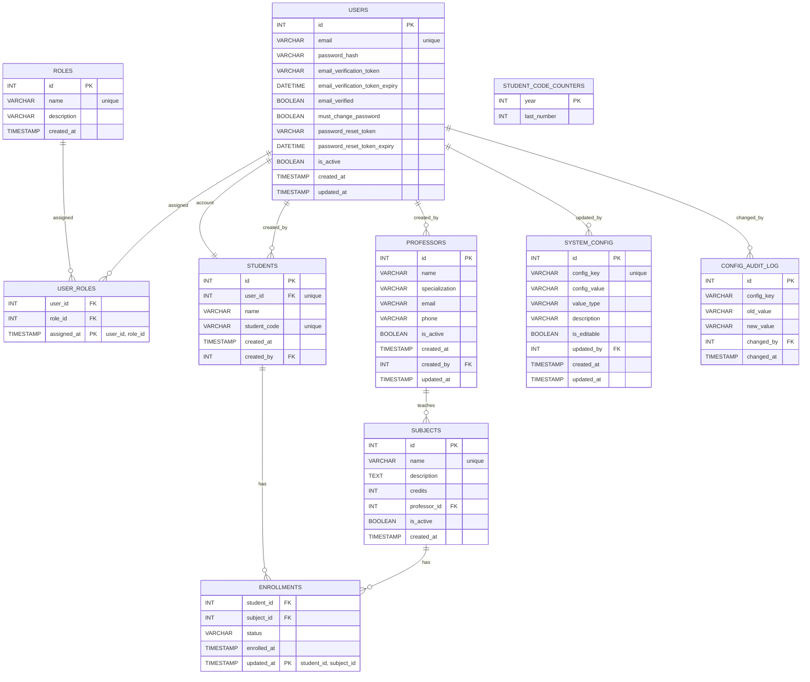

# Diagrama ER del Sistema de Inscripción Estudiantil

Notas:
- `ENROLLMENTS.status` y `SYSTEM_CONFIG.value_type` se representan como `VARCHAR` para alinear con EF Core (conversión de enums a minúsculas).
- `STUDENT_CODE_COUNTERS` es auxiliar para el trigger `generate_student_code` (no tiene FKs).
